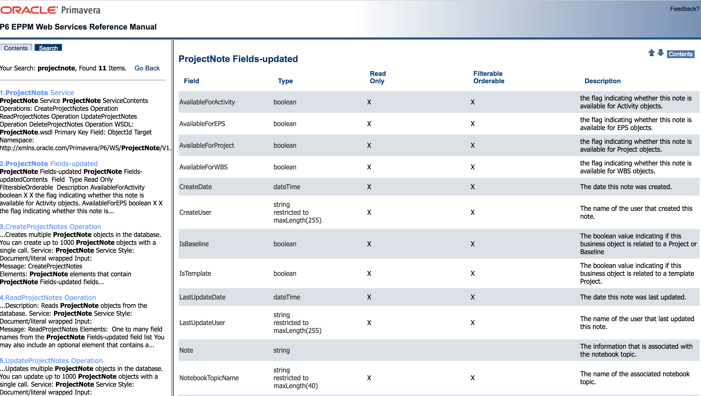
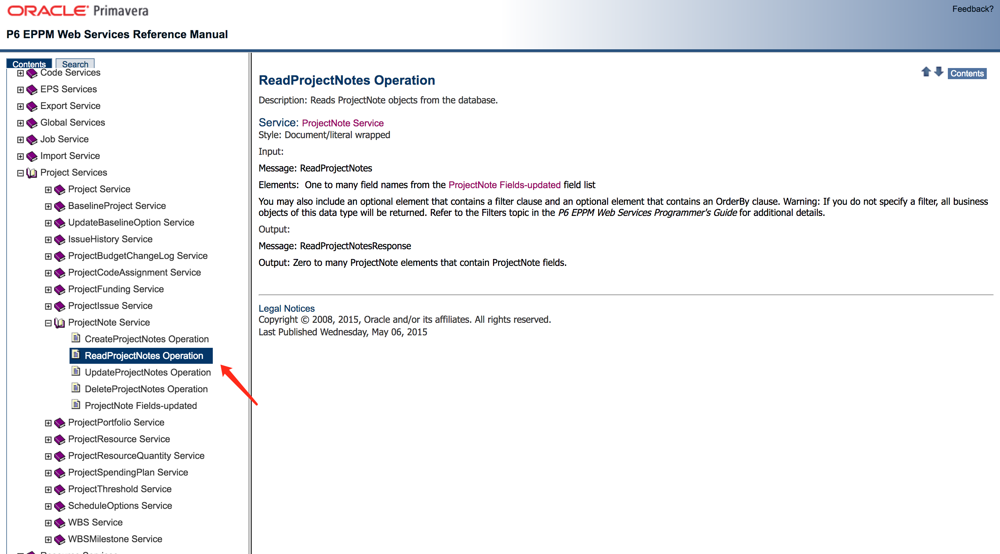

### Project Fields

| Field | Title |
|:-------:|:-------:|
| Id | 编码 |
| Name | 名称 |
| StartDate | 开始 |
| FinishDate | 完成 |
| SummaryPlannedDuration | 原定工期 |

### Wbs Fields

| Field | Title |
|:-------:|:-------:|
| Id | 编码 |
| Name | 名称 |
| StartDate | 开始 |
| FinishDate | 完成 |
| SummaryPlannedDuration | 原定工期 |

### Activity Fields

| Field | Title |
|:-------:|:-------:|
| Id | 编码 |
| Name | 名称 |
| StartDate | 开始 |
| FinishDate | 完成 |
| PlannedDuration | 原定工期 |
| Name | 作业名称 |
| PrimaryResourceName | 所属者 |
| ActualStartDate | 实际开始 |
| ActualFinishDate | 实际完成 |
| ExpectedFinishDate | 期望完成 |
| NotesToResources | 备注 |

### Note Fileds
记事本分为：项目\wbs记事本，作业记事本

#### ProjectNote Fields

| Field | Title |
|:-------:|:-------:|
| ProjectObjectId | 关联的项目ObjectId |
| WBSObjectId | 关联的WBSObjectId *ProjectObjectId与ProjectObjectId只需要一个参数，建议都是用wbsobjectid，项目也是有wbsid的* |
| NotebookTopicName | 笔记本标题 |
| RawTextNote| 笔记本内容 |
| CreateUser | 创建者 |
| CreateDate | 创建时间 |
| LastUpdateDate | 修改时间 |
| LastUpdateUser | 修改人 |

#### ActivityNote Fields
作业的笔记本字段信息

通过`ActivityNoteService`进行读取

| Field | Title |
|:-------:|:-------:|
| ActivityObjectId | 关联的作业ObjectId |
| NotebookTopicName | 笔记本标题 |
| RawTextNote| 笔记本内容 |
| CreateUser | 创建者 |
| CreateDate | 创建时间 |
| LastUpdateDate | 修改时间 |
| LastUpdateUser | 修改人 |

### Document Fields
文档字段信息

通过`ReadDocumentsService`进行读取

| Field | Title |
|:-------:|:-------:|
| ResourceObjectId | 关联的作业资源ObjectId |
| ProjectObjectId | 关联的项目ObjectId |
| Title | 文档标题 |
| Description| 文档描述 |
| Version | 文档版本 |
| Author | 文档作者 |
| PublicLocation | 文档url地址 |
| CreateUser | 创建者 |
| CreateDate | 创建时间 |
| LastUpdateDate | 修改时间 |
| LastUpdateUser | 修改人 |